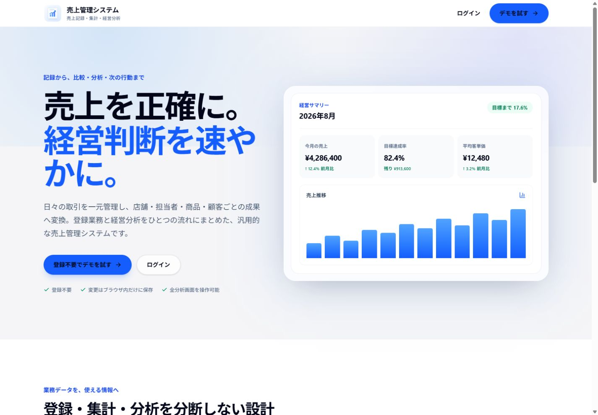
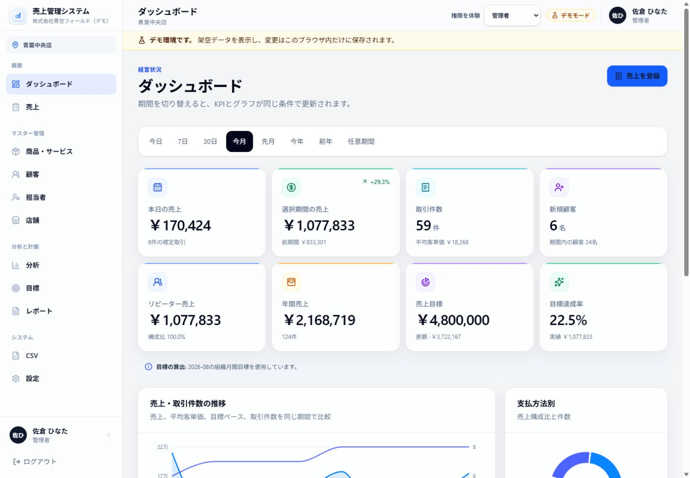
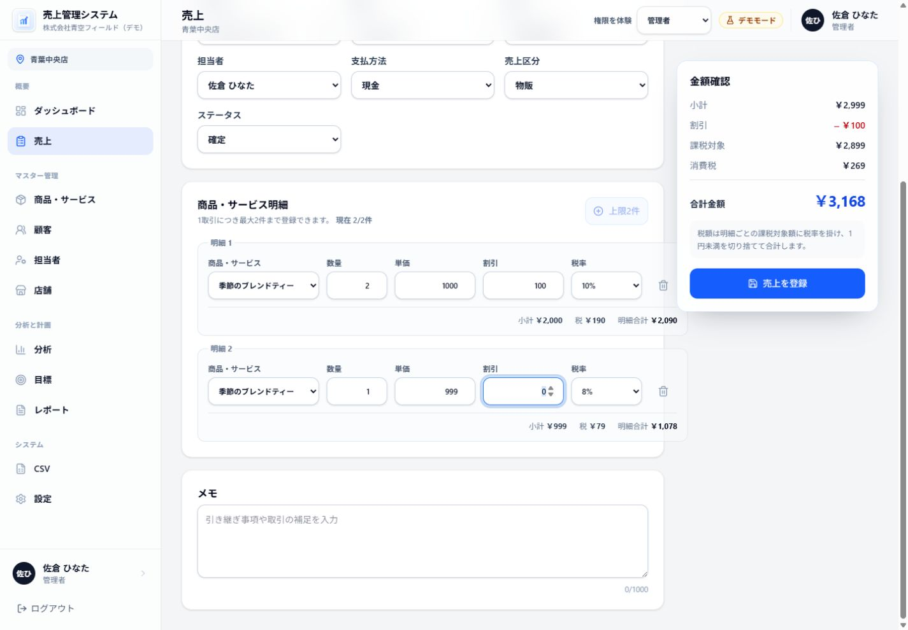
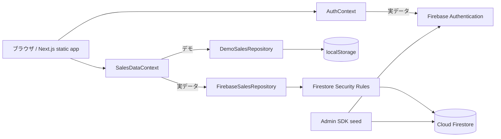

# 売上管理システム

> **Concept Project / 自主制作** — 実在企業から受託したシステムではなく、売上計算・権限・監査・分析を題材にしたポートフォリオ作品です。画面とサンプルデータはすべて自主制作です。

日々の売上を整数円で正確に記録し、店舗・担当者・商品・顧客・支払方法の視点へ集計して、経営判断に使える情報へ変換する Web 業務システムです。登録不要のブラウザ内デモと、Firebase Authentication / Cloud Firestore を使う実データモードを備えています。

> 画面に表示される人物、会社、店舗、連絡先、取引はすべて架空です。公開デモは登録不要で操作できます。

## Demo

- 公開デモ：<https://sales-management-system-three-sage.vercel.app/demo/>
- ランディングページ：<https://sales-management-system-three-sage.vercel.app/>
- GitHub：<https://github.com/shunsoco-stack/sales-management-system>
- ローカル確認：`npm run dev`の後、`http://localhost:3000/demo`を開く

Demo Modeの変更は閲覧者のブラウザ内に保存され、Firebaseの共有データへは書き込みません。

## Screenshots







## Implementation Scope

| 項目 | 実装内容 |
| --- | --- |
| Authentication | Firebaseメール／パスワード認証。登録不要のブラウザ内デモも提供 |
| Database | Cloud Firestore。デモは`localStorage`へ分離保存 |
| CRUD | 売上、商品・サービス、顧客、担当者、店舗、目標の登録・参照・更新 |
| Search | 取引番号、顧客、商品、担当者の検索と期間・店舗・金額・状態などの複合絞り込み |
| Permission | 管理者／マネージャー／一般／閲覧のみの4ロール、組織・店舗・自己売上の範囲制御 |
| Dashboard | 売上KPI、目標比較、前期間比、推移、支払構成、担当者・商品ランキング |
| Data Model | 明細を内包する売上、平坦化明細、各マスタ、目標、監査ログ |

## 想定ユーザー

- 小売店、サロン、美容室、飲食店、スクール、営業会社、サービス業、EC 事業者
- 売上を表計算ファイルや複数ツールで管理しているフリーランス、小規模〜中規模企業
- 全社・店舗・担当者の実績を同じ定義で比較したい管理者、マネージャー、現場担当者

## 解決する課題

- 最大 2 明細、割引、税、取消、返金を含む取引を一貫した計算規則で記録する
- 売上データを単なる一覧で終わらせず、KPI、目標差、前期間比、粗利、顧客行動へ変換する
- 店舗や担当者ごとに散在するデータを、組織・店舗スコープと権限で安全に共有する
- CSV 移行時の列不足、参照不整合、金額エラーを登録前に発見する
- 変更履歴を残し、取消済み・返金済み取引の改変や物理削除を避ける

## 主な機能

### 認証・デモ

- Firebase Authentication のメールアドレス／パスワード認証
- ログイン、新規組織・管理者登録、ログアウト、パスワード再設定、日本語エラー表示
- 登録不要のデモログイン、4 ロール切替、ブラウザ内保存、初期データへのリセット
- Firebase 未設定時もデモは利用可能。デモ経路では Firebase サービスを初期化しない遅延構成

### 売上業務

- 最大 2 件の商品・サービス明細を持つ売上の登録・編集
- 数量、単価、明細割引、税率から、小計 → 割引 → 税 → 合計をリアルタイム計算
- 取引詳細、複製、ブラウザ印刷、理由付き取消、全額／一部返金、更新履歴
- 取引番号・顧客・商品・担当者のキーワード検索
- 期間、店舗、担当者、商品、支払方法、金額範囲、ステータスの複合絞り込み
- 売上日時／登録日時／金額／取引番号の並び替え、15 件単位のページネーション
- 確定、未確定、取消、返金、一部返金を、文字・アイコン・色で区別

### マスタ・目標

- 商品・サービス: 登録、編集、無効化、検索、種別・カテゴリ・状態絞り込み、CSV 出力
- 顧客: 登録、編集、検索、状態絞り込み、購入指標、直近 10 件の売上履歴、前回購入内容、CSV 出力
- 担当者: 所属、役職、表示用の業務ロール、月間目標、有効状態の登録・編集と当月分析
- 店舗: 店舗コード、住所、電話番号、有効状態の登録・編集と当月分析
- 目標: 組織／店舗／担当者 × 月間／年間の登録・編集、実績、差額、達成率
- 支払方法初期値: 現金、クレジットカード、QR コード決済、電子マネー、銀行振込、その他

### ダッシュボード・分析・レポート

- 今日、7 日、30 日、今月、先月、今年、前年、任意期間の切替
- 本日の売上、選択期間の売上・件数・平均客単価、新規顧客、リピーター売上、年間売上、目標、達成率、経過日数に対する目標ペース
- 売上・取引件数の推移、前期間比較、支払方法構成
- 担当者／店舗: 売上、件数、平均客単価、構成比、目標、達成率、前月比、順位
- 商品・サービス／カテゴリ: 売上、販売数、平均単価、構成比、前月比、粗利額、粗利率
- 顧客: 新規・既存売上、平均購入金額、リピート率、上位顧客、90 日超の休眠候補
- 支払方法: 売上、件数、構成比
- 日報・月報の画面表示とブラウザ印刷。PDF ファイルを直接生成する機能は未実装

### CSV・監査・権限

- 売上、顧客、商品・サービス、担当者別売上、店舗別売上の UTF-8 BOM 付き CSV 出力
- 売上、商品・サービス、顧客の CSV 取込
- 必須列、列数、型、金額、参照 ID、取引内共通項目、既存／入力内重複、売上 2 明細上限の検証、行別エラー、先頭 8 行プレビュー
- CSV 数式注入対策、RFC 4180 形式の引用符・改行処理
- 売上・マスタ・目標の変更を、変更前／変更後とともに監査ログへ記録
- 管理者、マネージャー、一般ユーザー、閲覧のみの 4 ロール

CSV の列と制約は [docs/CSV_SPEC.md](docs/CSV_SPEC.md)、Firestore の詳細は [docs/FIRESTORE_SCHEMA.md](docs/FIRESTORE_SCHEMA.md) を参照してください。

## デザインとアクセシビリティ

Apple Design の「目的を先に示す」「操作の主体性を保つ」「馴染みのある構造」「単純さ」「細部の完成度」を、情報量の多い業務画面へ適用しています。装飾よりも数値の読みやすさ、比較のしやすさ、操作の発見性を優先しています。

- システムフォント、明確な情報階層、整数・金額の `tabular-nums`
- 原則 44px 以上の操作領域、即時フィードバック、控えめな半透明素材
- デスクトップのサイドバー、モバイルのドロワー、表のカード化／横スクロール
- `focus-visible`、フォームラベル、ARIA、Escape で閉じるダイアログ、フォーカス復元
- 矢印・数値・テキストを併用し、状態や増減を色だけに依存させない表示
- `prefers-reduced-motion`、`prefers-reduced-transparency`、`prefers-contrast`、forced colors への配慮

## 使用技術

| 区分 | 技術 |
| --- | --- |
| フレームワーク | Next.js 16.3（App Router / static export）、React 19.2 |
| 言語 | TypeScript 5.9 |
| UI | Tailwind CSS 4.3、Lucide React、Sonner |
| グラフ | Recharts 3.10 |
| 日付・検証 | date-fns 4.4、Zod 4.4 |
| 認証・DB・配信 | Firebase Authentication、Cloud Firestore、Firebase Hosting |
| テスト | Vitest 4.1、Testing Library、Firebase Rules Unit Testing |
| seed | Firebase Admin SDK、tsx |

## システム構成



- `src/app`: 公開ページ、認証画面、保護された業務画面
- `src/features`: ダッシュボード、売上、各マスタ、分析、目標、レポート、CSV、設定
- `src/components`: AppShell と再利用可能な UI 部品
- `src/lib/sales`: 型、金額計算、期間・KPI・分析、検索、権限、CSV、決定的サンプルデータ
- `src/lib/sales-repository.ts`: ブラウザ内デモと Firestore の共通 Repository 実装
- `firestore.rules` / `firestore.indexes.json`: テナント・権限・金額・監査の境界と複合インデックス
- `scripts/seed.ts`: Auth、マスタ、売上、監査、日次／月次集計の固定 ID seed

`next.config.ts` は `output: "export"` です。本番 build は静的ファイルを `out/` へ生成し、Next.js サーバーは使用しません。

## Design / Engineering Decisions

- 金額は整数円で扱い、明細小計、割引、税、返金の計算を純粋関数へ分離しています。
- デモとFirebase実データモードをRepository境界で切り替え、画面側の業務操作を保存先から分離しています。
- 最大2明細という現行境界は、Firestore Rulesで明細式と親合計を検証しつつ式評価上限内へ収めるための設計判断です。
- 売上変更と監査ログは同じcommitで整合させ、画面の権限制御に加えてSecurity Rulesでも組織・店舗・役割を検証します。

## データ構造

主要エンティティは `id` に加えて、原則として次の監査・スコープ項目を持ちます。

```text
organizationId / locationId / createdAt / createdBy / updatedAt / updatedBy
```

売上は `sales` ドキュメント内に明細 `items[]` を埋め込み、取引と明細金額を同時に読み取れるようにしています。seed は外部集計用途を想定した平坦な `saleItems` も作成しますが、現在の画面は埋め込み明細を使用します。詳細なフィールド、集計コレクション、購読上限は [docs/FIRESTORE_SCHEMA.md](docs/FIRESTORE_SCHEMA.md) に記載しています。

## 売上計算と集計の考え方

すべての金額は浮動小数ではなく整数円、税率は basis points（`1000 = 10%`、`800 = 8%`）で保持します。

各明細の計算順序:

```text
小計       = 数量 × 単価
課税対象額 = 小計 - 明細割引
消費税     = floor(課税対象額 × 税率basis points / 10,000)
明細合計   = 課税対象額 + 消費税
取引合計   = 各明細の値を合算（取引単位で税を再丸めしない）
```

純売上の認識:

| ステータス | 純売上 |
| --- | --- |
| 確定 | 合計 − 記録済み返金額 |
| 一部返金 | 合計 − 一部返金額 |
| 未確定 | 0 円 |
| 取消 | 0 円 |
| 全額返金 | 0 円 |

KPI は選択期間と同じ条件で再計算します。平均客単価は `floor(純売上 / 確定系取引件数)`、目標差額は `実績 − 目標`、達成率は `実績 / 目標 × 100`、前期間比は `(当期 − 前期) / |前期| × 100` です。前期が 0 円で当期が非 0 円の場合は割合を表示せず「比較不可」とします。商品粗利は返金比率を明細へ配分し、税抜認識額から認識原価を差し引きます。配賦の 1 円未満端数は最後の明細へ集約して親純売上と完全一致させ、粗利率は税抜認識売上を分母にします。

現在の Firestore 画面集計は、組織・店舗・担当者で絞った購読スナップショットをブラウザ側で集計します。`sales` の購読上限は 1,000 件です。seed が作る `dailySummaries` / `monthlySummaries` は将来のサーバー集計用で、現在の画面は参照せず、通常の売上操作でも自動更新しません。

## Firestore 設計と Security Rules

トップレベルコレクションは `organizations`、`users`、`locations`、`staff`、`customers`、`categories`、`products`、`paymentMethods`、`sales`、`saleItems`、`goals`、`settings`、`auditLogs`、`dailySummaries`、`monthlySummaries` です。予約領域として `dimensionSummaries`、`operationLocks`、`saleCounters` も Rules に定義しています。

Rules の主な制御:

- 未ログイン、無効ユーザー、無効組織、未知のコレクションを拒否
- `organizationId` と `allowedLocationIds` による組織・店舗分離
- 一般ユーザーは自身に対応する担当者 ID が一致する売上だけを閲覧・編集
- 閲覧のみユーザーの書込を拒否
- 売上の物理削除を禁止し、取消・返金は管理者だけに限定
- 取消済み・全額返金済み取引の再編集を禁止
- 金額を 0〜10 億円の整数、税率を 0〜100%、数量を 1〜10,000、明細を最大 2 件に制限
- `organizationId`、作成者、作成日時の改ざんを拒否
- 売上・マスタ・目標の書込と対応する監査ログを同一バッチに束縛し、更新前 `updatedAt` を監査ログへ保持して古い版からの上書きを拒否
- 監査ログを追記専用、集計・平坦明細をクライアント読取専用にする
- ユーザー自身によるロール・所属店舗・有効状態の変更を禁止

Rules は `小計 = 数量 × 単価`、`税 = floor(課税対象 × 税率 / 10,000)`、明細から親取引への合計、取消時のライフサイクル項目限定、返金累計の単調増加を検証します。権限表、各コレクションの可否、インデックスは [docs/FIRESTORE_SCHEMA.md](docs/FIRESTORE_SCHEMA.md) を参照してください。

## 環境構築

前提:

- Node.js 20.9 以上
- npm
- Firebase 実データモードまたは Emulator を使う場合は Firebase プロジェクトと Firebase CLI
- Rules テストを実行する場合は Java Runtime

```bash
git clone <repository-url>
cd sales-management
npm install
cp .env.example .env.local
npm run dev
```

`http://localhost:3000` を開きます。Firebase を設定していない場合は「デモを試す」を選択してください。

## 環境変数

| 変数 | 用途 | 公開可否 |
| --- | --- | --- |
| `NEXT_PUBLIC_FIREBASE_API_KEY` | Firebase Web API key | クライアントへ埋込 |
| `NEXT_PUBLIC_FIREBASE_AUTH_DOMAIN` | Auth domain | クライアントへ埋込 |
| `NEXT_PUBLIC_FIREBASE_PROJECT_ID` | Web SDK の Project ID | クライアントへ埋込 |
| `NEXT_PUBLIC_FIREBASE_STORAGE_BUCKET` | Firebase config | クライアントへ埋込 |
| `NEXT_PUBLIC_FIREBASE_MESSAGING_SENDER_ID` | Firebase config | クライアントへ埋込 |
| `NEXT_PUBLIC_FIREBASE_APP_ID` | Firebase App ID | クライアントへ埋込 |
| `NEXT_PUBLIC_USE_FIREBASE_EMULATORS` | `true` で Auth / Firestore Emulator 接続 | クライアントへ埋込 |
| `NEXT_PUBLIC_FIREBASE_EMULATOR_HOST` | Emulator host。既定 `127.0.0.1` | クライアントへ埋込 |
| `GOOGLE_APPLICATION_CREDENTIALS` | seed 用サービスアカウント JSON のパス | 秘密情報 |
| `FIREBASE_SERVICE_ACCOUNT_JSON` | seed 用サービスアカウント JSON 本文 | 秘密情報 |
| `FIREBASE_PROJECT_ID` | seed / Admin SDK 用 Project ID 補助値 | サーバー側 |
| `DEMO_SEED_PASSWORD` | seed が作る 4 Auth ユーザーの共通パスワード | 秘密情報 |
| `NEXT_PUBLIC_DEMO_URL` | ポートフォリオ公開後のデモ URL | クライアントへ埋込 |
| `NEXT_PUBLIC_GITHUB_URL` | ポートフォリオ公開後の GitHub URL | クライアントへ埋込 |

Web SDK の初期化判定には API key、Auth domain、Project ID、App ID の 4 値が必要です。`NEXT_PUBLIC_*` は build 成果物へ入るため、サービスアカウントやパスワードを絶対に設定しないでください。

## Firebase 設定

1. Firebase Console でプロジェクトと Web アプリを作成する。
2. Authentication の「メール/パスワード」を有効化する。
3. Cloud Firestore を作成する。
4. Web アプリ設定を `.env.local` の `NEXT_PUBLIC_FIREBASE_*` へ設定する。
5. Authentication の承認済みドメインへ本番 Hosting ドメインを追加する。
6. Rules と Indexes をデプロイする。

```bash
firebase projects:list
npm run firebase:deploy -- --project <PROJECT_ID>
```

ローカル Emulator を使う場合:

```bash
# .env.local
NEXT_PUBLIC_USE_FIREBASE_EMULATORS=true
NEXT_PUBLIC_FIREBASE_EMULATOR_HOST=127.0.0.1

npm run firebase:emulators -- --project demo-sales-management-local
```

Auth `9098`、Firestore `8081`、Hosting `5003`、Emulator UI `4001` を使用します。

## seed データ

2026-08-08 12:00 JST を基準にした dry run では、次を生成します。

| データ | 件数 |
| --- | ---: |
| 店舗 | 3 |
| 担当者 | 6 |
| 顧客 | 36 |
| カテゴリ | 6 |
| 商品・サービス | 24 |
| 支払方法 | 6 |
| 売上 | 194 |
| 平坦明細 | 291 |
| 目標 | 11 |
| 監査ログ | 195 |
| Auth / users | 4 |
| 日次集計 / 月次集計 | 154 / 15 |
| Firestore ドキュメント合計 | 947 |

今月、前月、前年、全 5 ステータス、取消理由、全額・一部返金、新規・リピーター・高売上・休眠候補を含みます。同じ基準日時ならバイト単位で同じデータを生成します。

```bash
# 検証のみ。Admin SDKを初期化しない
npm run seed -- --project demo-sales-management-local --dry-run --reference-date 2026-08-08T12:00:00+09:00

# Emulatorへ書込。12文字以上のパスワードをローカル環境変数へ設定
$env:DEMO_SEED_PASSWORD = "<SET_LOCALLY_AND_DO_NOT_COMMIT>"
npm run seed -- --project demo-sales-management-local --emulator --confirm demo-sales-management-local

# demo- で始まらないプロジェクトは明示的な二重確認が必要
npm run seed -- --project <PROJECT_ID> --confirm <PROJECT_ID> --allow-production
```

seed実行時は、Emulatorを含め12文字以上の `DEMO_SEED_PASSWORD` が必要です。実プロジェクトへの書込では、さらに `GOOGLE_APPLICATION_CREDENTIALS` または `FIREBASE_SERVICE_ACCOUNT_JSON` が必要です。スクリプトは固定 ID を `set` で投入し、同じ ID は更新しますが、対象外の既存ドキュメントを削除しません。Admin SDK は Security Rules を経由しないため、投入先 Project ID と認証情報を必ず確認してください。

seed Auth アカウント:

| ロール | メール |
| --- | --- |
| 管理者 | `admin@sales-demo.invalid` |
| マネージャー | `manager@sales-demo.invalid` |
| 一般ユーザー | `user@sales-demo.invalid` |
| 閲覧のみ | `viewer@sales-demo.invalid` |

`.invalid` ドメインは架空データ用です。

## CSV 仕様

出力は UTF-8 BOM 付き、CRLF、全セルをダブルクォートで囲む形式です。入力は BOM の有無、カンマ、エスケープ済み引用符、セル内改行に対応します。売上インポートは「1 明細 1 行」で、同じ取引番号の最大 2 行を 1 取引へまとめます。新規売上の受入ステータスは `confirmed` / `pending` だけです。画面プレビューの段階で、既存データと入力内の重複、商品原価が販売価格を超えないことも検証します。

Firebase への売上 CSV 取込は、Security Rules の式評価上限を考慮して 4 売上（売上 4 件 + 監査ログ 4 件）ごとに commit します。各 commit は原子的ですが、ファイル全体を 1 トランザクションにはしていないため、後続 commit が失敗した場合に先行分を自動ロールバックしません。

売上一覧エクスポートは「1 取引 1 行」の分析用形式であり、売上インポート形式とは列構成が異なるため、そのまま再取込はできません。画面の「雛形をダウンロード」を使用してください。全列、受入値、検証内容は [docs/CSV_SPEC.md](docs/CSV_SPEC.md) に記載しています。

## デモモード

- `/demo` またはログイン画面の「デモを試す」から管理者ロールで開始
- セッション: `sales-management:demo-session:v1`
- データ: `sales-management:demo-data:v1`
- 変更はそのブラウザの `localStorage` にだけ保存され、他の閲覧者や Firestore へ送信されない
- ヘッダーまたは設定画面で 4 ロールを切り替えられる
- 設定画面の「初期データへ戻す」で決定的 seed に復元できる
- `localStorage` が使用できない環境では、同一ページ実行中のメモリへフォールバックする

## 権限設計

| 操作 | 管理者 | マネージャー | 一般 | 閲覧のみ |
| --- | :---: | :---: | :---: | :---: |
| 組織内の売上閲覧 | ✓ | ✓ | 自分のみ | ✓ |
| 売上登録 | ✓ | ✓ | ✓ | — |
| 売上編集 | ✓ | ✓ | 自分のみ | — |
| 取消・返金 | ✓ | — | — | — |
| 商品・顧客管理 | ✓ | ✓ | — | — |
| 担当者・店舗・目標・設定 | ✓ | — | — | — |
| 分析・レポート | ✓ | ✓ | — | ✓ |
| CSV 入出力 | ✓ | — | — | — |
| 監査ログ閲覧 | ✓ | ✓ | — | — |

すべての閲覧は組織と許可店舗の範囲内です。一般ユーザーの「自分」は `users.staffId` と売上の `staffId` の一致で判定します。画面側の Permission 判定に加え、Firestore Rules でも同じ境界を検証します。現在、実ユーザーのロールを管理者が変更するユーザー管理画面はなく、`users.role` はクライアントから変更できません。担当者マスタのロール欄は担当者情報であり、Firebase Auth ユーザーの権限付与とは連動しません。

## テスト

```bash
npm run lint
npm run typecheck
npm run test
npm run test:rules
npm run build

# Rulesテスト以外を一括実行
npm run verify
```

通常の `npm run test` は、金額・割引・明細別税切捨て、返金、KPI、期間、分析、検索・絞り込み、権限、CSV、決定的 seed、Repository、共通 UI、モバイルドロワーを対象にします。`npm run test:rules` は Firestore Emulator 上の 22 ケースで、未認証／他組織、自己売上クエリ、閲覧のみ、監査バッチ、明細式と親合計、古い版からの上書き、取消・累積返金、組織 ID 改ざん、自己昇格、初期テナント作成などを検証します。

手動確認項目と記録欄は [docs/MANUAL_QA.md](docs/MANUAL_QA.md) を使用してください。

## build

```bash
npm run build
```

`out/` に Firebase Hosting 配信用の静的成果物を生成します。`npm run preview` は Hosting Emulator で `out/` を配信します。環境変数は build 時にクライアントへ埋め込まれるため、値を変更したら再 build が必要です。

## デプロイ

```bash
firebase projects:list

# Hostingのみ。firebase.jsonのpredeployでbuildを実行
npm run hosting:deploy -- --project <PROJECT_ID>

# Hosting、Firestore Rules、Indexesをまとめてデプロイ
npm run firebase:deploy -- --project <PROJECT_ID>
```

Firebase実データモードを公開する場合は、Authentication の承認済みドメイン、Rules、Indexes、リンク、コンソールエラーを確認してください。現在のVercel公開デモはFirebase設定を持たず、ブラウザ内デモだけを提供します。

## Security / Privacy

- 公開デモは架空データだけを使用し、変更を閲覧中ブラウザの`localStorage`へ保存します。Firestoreや他の閲覧者へ送信しません。
- FirebaseモードではAuthenticationとFirestore Rulesで組織・店舗・ロール・自己売上の範囲を検証し、売上の物理削除を禁止して業務変更と監査ログを対応させます。
- サービスアカウント、seed用パスワード、秘密鍵は環境変数だけで扱います。`NEXT_PUBLIC_*`にはFirebase Web SDKの公開クライアント設定以外を保存しません。
- seedは対象projectと確認値を明示し、実projectへの投入には追加フラグを要求します。Admin SDKはRulesを経由しないため、実行前に認証情報と対象projectを確認してください。
- 実運用ではApp Check、登録・招待制御、レート／使用量アラート、バックアップ、保持・削除方針、インシデント対応を追加してください。

## Known Limitations

- 1 取引の売上明細は最大 2 件。Firestore Rules 内で明細式と親合計を厳密検証し、式評価上限内に収めるための現行境界
- Firestore の `sales` 購読は最大 1,000 件で、画面集計はその購読範囲を対象とする
- `dailySummaries` / `monthlySummaries` は seed のみが生成し、通常操作では更新せず、画面も未使用
- Firestore モードでは売上変更時に顧客マスタの累計値を永続更新するサーバー処理が未実装。画面は購読中の最大 1,000 売上から派生値を再計算し、デモ Repository はローカルデータにも反映する
- 実ユーザーの招待・ロール変更・無効化 UI、カテゴリ管理 UI、支払方法管理 UIは未実装
- ブラウザ印刷には対応するが、PDF ファイル生成は未実装
- 売上一覧エクスポートと売上インポートは用途が異なり、直接の往復変換には非対応
- Firebase の売上 CSV 取込は 4 売上単位で commit するため、ファイル全体では原子的でない
- 公開デモはVercelへデプロイ済み。Firebase本番プロジェクトは未設定で、公開URLではブラウザ内デモのみ提供

## 今後の拡張案

- Cloud Functions / Cloud Run による顧客指標、日次・月次・担当者・商品集計のトランザクション更新
- 集計ドキュメントとカーソルページネーションによる 1,000 件超の運用
- 管理者によるユーザー招待、ロール・許可店舗変更と `permission_change` 監査
- カテゴリ、支払方法、税設定の管理画面
- 返金明細、締め処理、会計期間ロック、連番発番のサーバー化
- PDF レポート生成、メール配信、定期レポート
- Cloud Storage を使った大容量 CSV ジョブと取込結果ファイル
- 3 明細以上や大規模一括取込を扱う信頼済みサーバー書込 API

## 関連ドキュメント

- [Firestore スキーマ・Rules・Indexes](docs/FIRESTORE_SCHEMA.md)
- [CSV 仕様](docs/CSV_SPEC.md)
- [手動 QA チェックリスト](docs/MANUAL_QA.md)
- [ポートフォリオ掲載情報](docs/portfolio.md)
- [ポートフォリオ追加用 Codex プロンプト](docs/portfolio-addition-codex-prompt.md)

## License / Asset Origin

このリポジトリには`LICENSE`ファイルを設定していません。ソースコード、文章、スクリーンショットの著作権は制作者に留保され、無断での再利用・再配布はできません。UIアイコンなどの依存パッケージには、それぞれのライセンスが適用されます。

サンプルの人物、組織、店舗、商品、連絡先、取引はすべて架空です。実運用へ導入する場合は、組織固有の個人情報管理、バックアップ、監視、保持期間、インシデント対応を追加してください。
